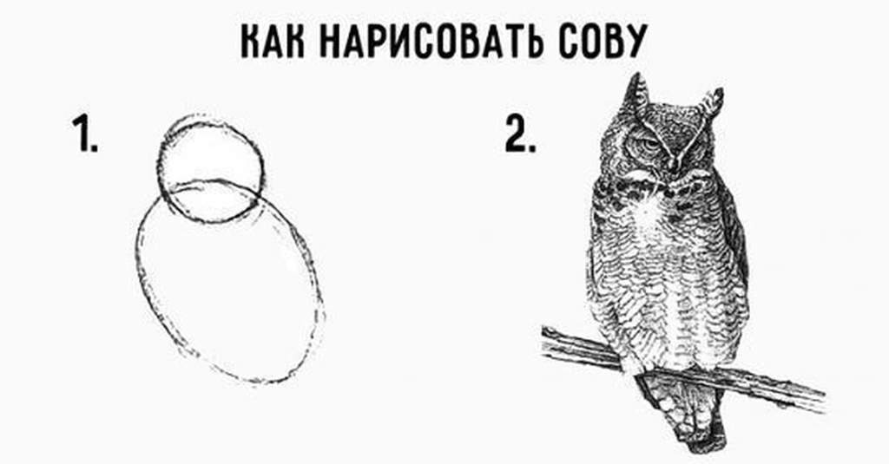
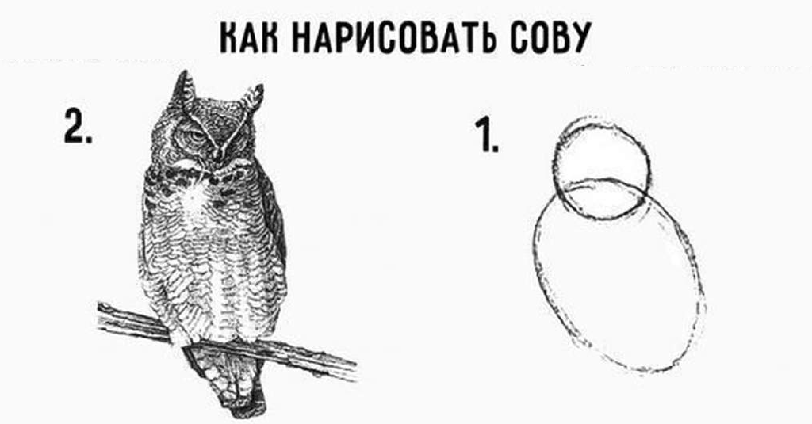
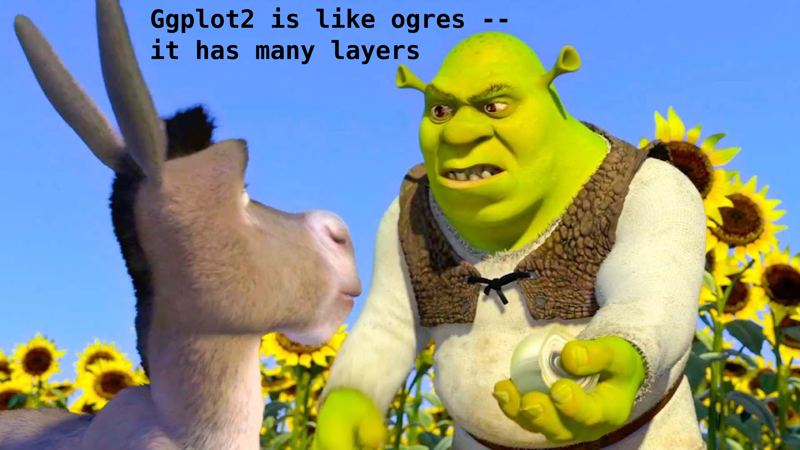
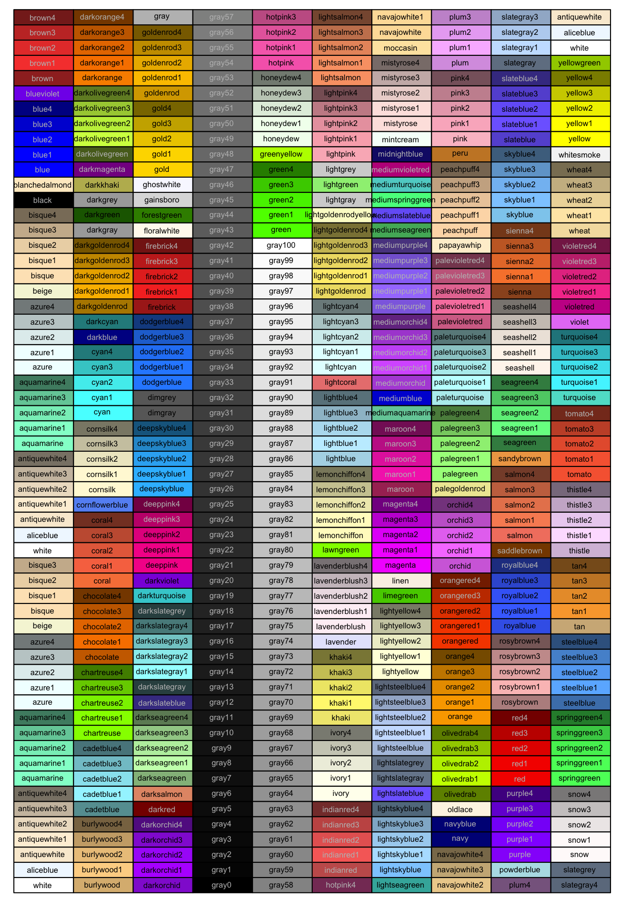
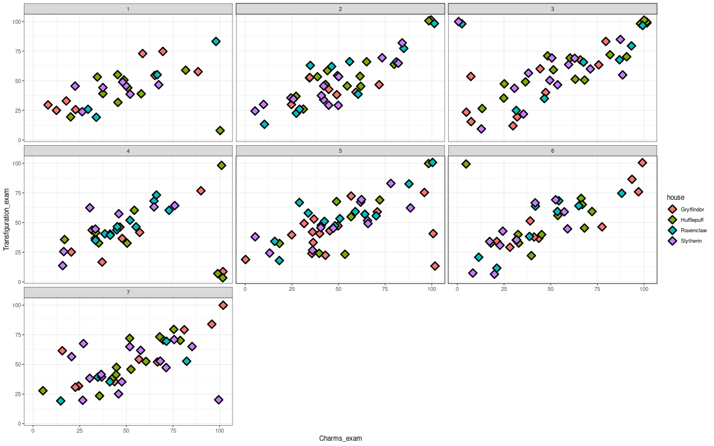
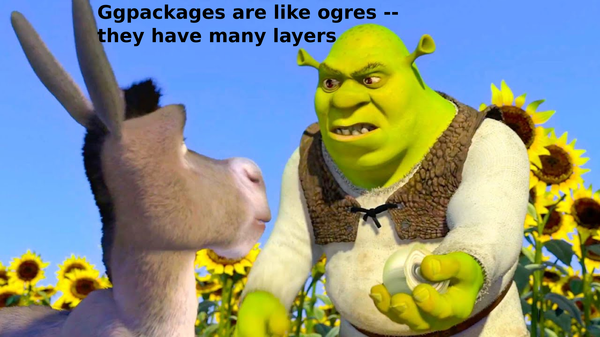

## Прелиминарии

Настраиваем rmd, подгружаем пакеты

```{r setup, include=FALSE}
knitr::opts_chunk$set(echo = TRUE, message = FALSE, warning = FALSE, error = FALSE, fig.width=16, fig.height=10)
# install.packages("ggExtra")
# install.packages("ggpubr")
library(tidyverse)
library(ggExtra)
library(ggpubr)
```

Подгружаем датасет

```{r dataLoading}
hogwarts <- read_csv("data/hogwarts.csv")
hogwarts
```

## Действо

{width="2024"}





### Страшный блок с кодом

```{r ggplotIntro, fig.width=20, fig.height=14}
fillValues <- c("#C50000", "#ECB939", "#41A6D9", "#1F5D25")
names(fillValues) <- hogwarts %>% select(house) %>% pull() %>% unique()
gridLab <- c("Девочки", "Мальчики")
names(gridLab) <- hogwarts %>% select(sex) %>% pull() %>% unique() %>% sort()

ggplot(hogwarts, aes(y = house,
                     x = result))+
geom_violin(aes(fill = house))+
geom_boxplot(width = 0.05,
             colour = "grey50")+
geom_vline(xintercept = 0,
           linetype = "dashed",
           colour = "salmon",
           linewidth = 2)+
labs(
title = "Баллы студентов Хогвартса",
subtitle = "Распределение числа баллов у студентов различных факультетов Хогвартса в 2023-2024 учебном году",
y = "Колледж",
x = "Количество очков",
fill = "Колледж",
caption = "Источник: нездоровая фантазия автора лекции"
   )+
facet_grid(. ~ sex,
           labeller = labeller(sex = gridLab))+
theme_bw()+
theme(plot.title = element_text(size=32,
                              hjust=0.5,
                              family = "Times new roman"),
    plot.subtitle = element_text(size = 20,
                                 hjust=0.5,
                                 colour = "#7D5535"),
    axis.text.x = element_blank(),
    axis.text.y = element_text(size=20,
                               family = "Times new roman"),
    axis.title.x = element_blank(),
    axis.title.y = element_text(size=29,
                                family = "Times new roman"),
    legend.title = element_text(size=25,
                                family = "Times new roman"),
    legend.text = element_text(size=25,
                               family = "Times new roman",
                               face = "italic"),
    strip.text.x = element_text(size = 25,
                                family = "Times new roman"))+
scale_fill_manual(name = "Факультет",
                  labels = c("Гриффиндор", "Пуффендуй", "Когтевран", "Слизерин"),
                  values = fillValues)+
scale_x_continuous(breaks = seq(-400, 400, by = 50))+
  annotate(geom = "segment", arrow = arrow(), y = rep("Ravenclaw",2), yend = rep("Slytherin",2), x = c(250, -250), xend = c(250, -250), linewidth = 1.3, colour = "black")+
  coord_flip()
```

### Одна количественная переменная

Как мы можем показать на рисунке одну количественную переменную?

```{r gh1}

```



Делаем гистограмму сами

```{r histogramSelf}

```

Легким движением, гистограмма превращается...

```{r density}

```


```{r boxPlot, fig.width=10}

```

### Сравнение нескольких количественных переменных

```{r twoDistr}

```

```{r threeDistr}

```

```{r boxFactor}

```

```{r violin2factors}

```

```{r boxSelf}

```

### Одна факторная переменная

```{r pub}


###############################
# c("Gryffindor" = "#C50000",
#   "Hufflepuff" = "#ECB939", 
#   "Ravenclaw" = "#41A6D9", 
#   "Slytherin" = "#1F5D25")
################################
```

{width="500"}

### 2 факторные переменные

```{r 2factors}

```

```{r barSelf}

```

### Фактор с большим количеством градаций / тайм-серия / "недлинная" количественная переменная

```{r}

```

### 2 количественные переменные (1 факторная в подарок)

```{r 2num}

```

{width="1200"}

```{r scatterSelf}

```

### Так что там с третьей факторной переменной?

```{r grid}

```

```{r wrap}

```

## Фиоритуры



Тема

```{r theme}

```

Аннотация

```{r annotations}

```

## Кунштюки



```{r arrange}

```

```{r marginal}

```

## Дополнительные источники

-   [Сайт с примерами графиков и полезными советами](https://r-graph-gallery.com/)
-   [Оригинальная статья с изложением философии ggplot](https://byrneslab.net/classes/biol607/readings/wickham_layered-grammar.pdf)
-   [Документация ggplot](https://ggplot2.tidyverse.org/)
-   [Учебник по data-science от авторов ggplot](https://r4ds.hadley.nz/)
-   [Учебник по ggplot от авторов ggplot (в процессе написания)](https://ggplot2-book.org/)
-   [Телеграм-канал про визуализацию (не в биомедицине, и не на R, но от этого не менее хороший)](https://t.me/nastengraph)
-   [Шпаргалка по ggplot2](https://rstudio.github.io/cheatsheets/html/data-visualization.html)